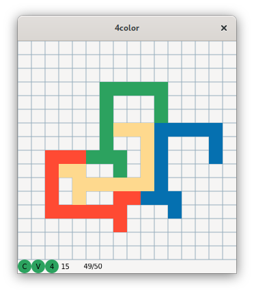

# 4Color
Four colors suffice to produce a map with adjacent regions in different colors, as the
famous theorem says. This program is about finding maps that *require* four colors.

It's not hard to come up with maps that require four colors. Here are a few.

A bigger challenge is to find a 4-color map that consists of four copies of the same
figure translated, rotated, and possibly reflected. In particular, I'm interested in
polyomino solutions, using shapes made of square tiles. Here's an example

Sure, there's a 5th figure left uncolored in the interior, and a 6th figure that makes up
the exterior. But for me, the reason four colors are required is that each colored figure
shares an edge with the other three copies.

# Usage
    4color

Clicking on the grid toggles tiles of the focused figure, initially the red one. The tab
key changes the focus. The focused figure is indicated by the color of the grid lines. All
other manipulation is done with keys.

Cursor keys
: Move the focused figure. Hold Shift to move all figures.

Page down (up)
: Rotate the focused figure 90° (counter) clockwise. Hold Shift to rotate all figures.

Space
: Flip left-right. Hold shift to flip all figures.

Tab
: Focus another figure.

C
: Erase all tiles.

W
: Open a file selector for saving a PNG image of the figures sans grid lines and status.

A status area at the bottom of the window shows information about the map. The "C" is for
"contiguous". A green circle is drawn there if all the tiles of each figure are joined by
edges. The 4-color theorem doesn't hold for non-contiguous regions. Here's a map that
requires five colors made from a 2-tile non-contiguous figure.

The "V" gets a green circle if all tiles of all figures are visible. I.e. no overlap.

The "4" gets a green circle if each figure shares an edge with the other figures.

Also shown are the number of tiles in each figure and the undo state. The current state
and the total number of saved states are shown. The first number is decremented when you
undo and incremented when you redo.

# Bugs
* Some figures walk away if you keep rotaing.
* Figures sometimes shift when toggling.
* Shift-rotate and shift-flip transform each figure about its center of mass. Should
  transform about the center of the grid.
* Grid and status not updated on resize.

# TODO
* Make the controls discoverable.
* Make it easier to tell which figure is focused.
* Define keymap and colors in external file?
* Triangular grid mode.
* Read in PNG files if they meet certain criteria.
* Read and write the state of the program?
